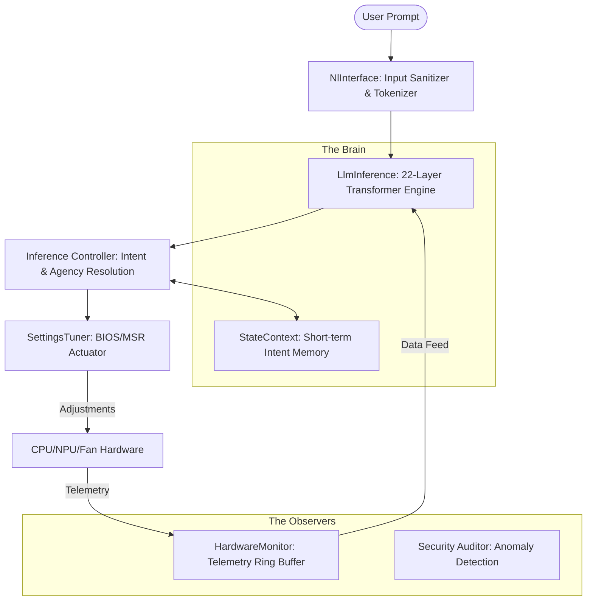

# 🤖 AiBios: The Autonomous Intelligence BIOS


**AiBios** is a revolutionary, AI-native firmware agent designed for the modern computing era. Moving beyond traditional static BIOS interfaces, AiBios integrates a **22-layer Transformer inference engine** directly into the UEFI pre-boot environment, transforming the motherboard's firmware into a proactive, context-aware autonomous agent.

---

## 🏗️ Architecture Overview

AiBios is built as a modular DXE driver within the EDK II framework. It bridges the gap between raw hardware telemetry and high-level natural language intent.



### 🧠 The Inference Engine
At the heart of AiBios lies a custom-built, fixed-point inference engine optimized for the constraints of a pre-boot environment.
- **Layers**: 22 Transformer layers.
- **Dimensionality**: 2048 embedding size.
- **Quantization**: High-precision **INT8 quantized** activations with dynamic scaling.
- **Memory Footprint**: Designed with **zero heap allocation** requirements for maximum stability.

---

## ✨ Key Features

### 🌍 Natural Language Intelligence
Interact with your hardware using plain English. Whether it's "Optimizing for high-performance gaming" or "Why is my fan so loud?", AiBios understands the semantic intent behind your requests.

### 💾 Contextual Agency
AiBios remembers. It maintains a short-term memory of recent interactions, allowing for follow-up commands like "do it" or "apply that" to execute complex configurations across multiple reboots.

### 🛡️ Proactive Security Audit
The `Security` module performs deep anomaly detection on BIOS variables and firmware state, identifying tampering or unauthorized changes before the OS even begins to load.

### 🌡️ Predictive Telemetry & Tuning
Utilizing a ring buffer of historical sensor data, AiBios doesn't just react—it predicts.
- **HardwareMonitor**: Monitors CPU Temp, Fan RPM, Voltages, and SSD Health.
- **SettingsTuner**: Dynamically adjusts PCI-E paths, Fan curves, and NPU offloading based on real-time AI workloads.

---

## 🛠️ Developer Guide

### Prerequisites
- [EDK II](https://github.com/tianocore/edk2) Environment.
- NASM (for IA32/X64 assembly).
- GCC or MSFT Build Tools.

### Building
The project includes a specialized build wrapper for the `AiBiosPackage`:
```powershell
.\run_build.bat
```
To run integration tests:
```powershell
.\run_build.bat test
```

### Emulation (QEMU)
You can test AiBios in a virtualized OVMF environment:
```powershell
cd run_qemu
.\run_qemu.bat
```

---

## 📁 Repository Structure

- `AiBiosPackage/`: Main package directory.
  - `AiBiosMain/`: Entry point and orchestration logic.
  - `LlmInference/`: The core Transformer engine implementation.
  - `HardwareMonitor/`: Telemetry gathering and trend analysis.
  - `SettingsTuner/`: Actuation layer for BIOS/MSR settings.
  - `NlInterface/`: Multi-lingual natural language parsing.
  - `Security/`: Forensic firmware auditing.

---

> [!TIP]
> **Proactive Tip**: Use the `status` command in the AiBios shell to see a real-time dashboard of your hardware telemetry and AI-driven health predictions.

---
*Developed as an experiment in Autonomous Firmware Agents.*